**ISMAR2023**

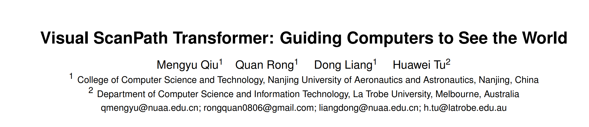

**Visual ScanPath Transformer: Guiding Computers to See the World**

**引言：**

眼球注视运动的研究，如注视估计，在VR/AR应用中起着至关重要的作用。一方面，凝视估计可以通过分析用户的眼球运动和凝视方向，准确跟踪用户的视觉行为，实现VR/AR中自然直观的人机交互(HCI)。另一方面，凝视估计可以实时预测准确的凝视位置，在此基础上，VR/AR系统可以执行更精确的注视点渲染，从而获得更准确的渲染结果和更低的计算负担。近年来，计算机视觉的研究在人眼注视和扫视路径预测方面取得了显著进展。人眼扫视路径描述了人眼在观察视觉场景时注视的顺序。VR/AR应用程序可以根据扫视路径预测结果提前生成注视点渲染结果，大大减少计算量。

人们通常在两种不同的状态下观察视觉场景:**自由观看**和**任务驱动观看**。 在本文中，我们提出了一种新的扫视路径预测模型，称为视觉 Transformer扫视路径预测器(VSPT)，用于预测自由观看和任务驱动观看情况下的人类扫视路径。该方法首先从视觉场景中提取与任务高度相关的图像特征，然后探索所有图像区域之间的全局依赖关系，生成每个图像区域的全局特征。其次，VSPT模拟人类视觉工作记忆，在预测每次注视时考虑所有先前注视的影响。实验结果证实，我们的模型在眼跳决策过程中表现出对经典视觉原则的遵守，在自由观看和任务驱动(目标驱动和问题驱动)视觉场景中超越了目前最先进的方法。

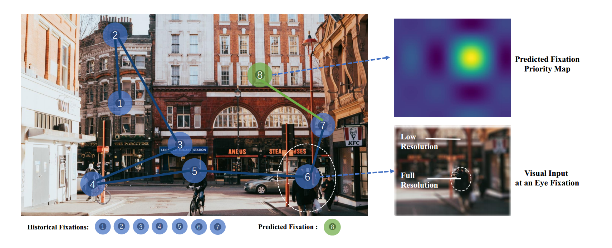

图1:人类的扫视路径由一系列注视和眼跳组成。注视时，中央凹的视觉输入以高分辨率进行处理，而周边视觉则相应地被模糊以指导眼跳。扫视路径预测模型通过预测下一次注视的优先概率地图来模拟人类的眼跳决策。

**方法：**

我们提出了一个VSPT模型，用于预测自由观看和任务驱动的视觉探索场景中的扫视路径。图2说明了我们提出的方法的总体框架。它由四个部分组成:特征提取器、视觉编码器、注视解码器和注视生成器。

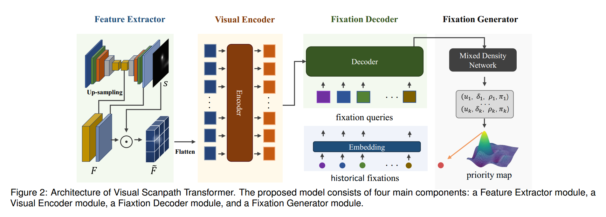

我们首先将输入的视觉场景图像通过特征提取器进行编码，以获得与扫视路径预测任务高度相关的显著性特征表示。具体来说，我们使用了显著性预测网络SalGAN，该网络在眼动追踪数据集上进行了预训练。

我们首先将图片I输入SalGAN，我们提取解码器各卷积层生成的特征图，并上采样到输入图像的原始大小，将它们连接起来，得到最终的特征映射。

为了更准确地模拟人类视觉系统中固有的分层注意机制，我们通过使用捕获视觉突出刺激的低水平显著性地图，以及考虑语义上下文的高水平上下文引导地图，对提取的视觉特征施加约束。

这可以表现为两种不同的形式:

**自由观看模式:** 在自由观看场景的背景下，人类的视觉探索过程是刺激驱动的，其特点是自下而上的注意机制。我们采用显著性图表示静态视觉刺激表征，对获得的视觉特征进行空间注意操作。这引导模型在解码阶段关注重要区域。该操作的具体定义为:

其中， 表示SalGAN模型输出的显著性映射，⊙表示哈达玛积。通过逐元素乘法，我们得到了空间注意力重加权的图像特征图。

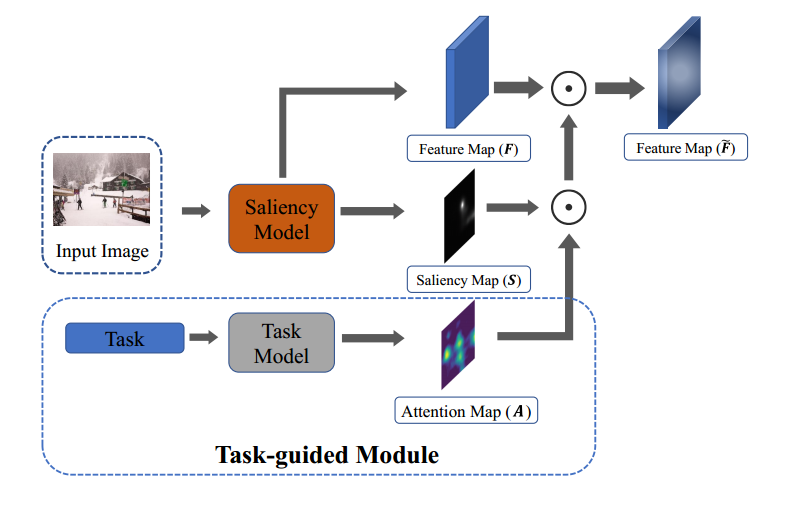

**任务驱动模式:** 在模拟任务驱动的视觉探索过程中，我们采用任务引导模块整合语义和视觉内容，通过任务引导图来表达任务的影响，从而突出与任务相关的图像区域。在这种模式下，人类视觉注意的控制过程受到低水平视觉刺激和高水平情境约束的共同影响。如图3所示，我们采用显著性图和任务引导图进行组合空间注意运算，定义如下:

其中，S表示显著性图，A表示任务引导图，⊙表示哈达玛积。

随后，视觉编码器模块进一步建模视觉特征区域之间的全局依赖关系。

我们使用一个附加的注视解码器模块与注视生成模块一起从视觉特征图中解码注视序列。扫视路径预测可以被认为是一个标准的序列生成任务，我们采用自回归方案来迭代预测注视点。首先，对于当前时间步为t，我们利用前一时间步长t - 1的注视坐标 初始化注视查询 ，该查询负责编码当前感兴趣区域的信息，并最终转化为相应的注视嵌入。具体来说，第一个注视查询使用图像中心作为初始坐标进行初始化。我们使用一个嵌入层来初始化注视查询，其定义为

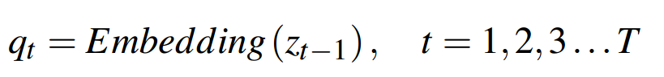

嵌入层采用线性映射，T表示预测序列的长度。接下来，注视查询被馈送到解码器，它也包含一组相同的解码器层。在每一解码器层，首先通过历史注视查询进行自注意，整合历史注视的影响，然后通过交叉注意与视觉编码器输出的视觉特征交互，获取场景信息，最后通过前馈网络后转化为注视嵌入。

注视在视觉扫视路径中的分布通常是多模态的，这意味着存在多种可能的注视。因此，我们采用混合密度网络(MDN)来预测注视的概率分布。MDN以注视解码器产生的注视嵌入作为输入，预测K组高斯分布参数，包括平均值µ、标准差σ、相关性ρ

和混合权值π。将MDN构建为包含隐藏层和ReLU激活层的2层感知器，利用K高斯对概率分布进行建模，其表示为:

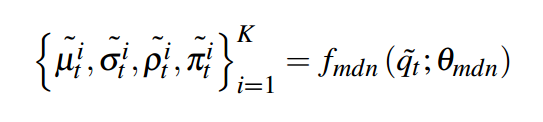

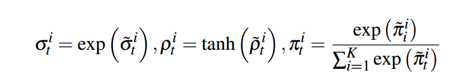

其中， 是注视解码器在时间步长为t时产生的注视嵌入， 表示线性层的权重和偏置。第二个公式将高斯参数的混合约束在一个合理的范围内。

K组高斯分布共同生成最终的概率图，从中选择概率最高的像素位置作为下一个注视。

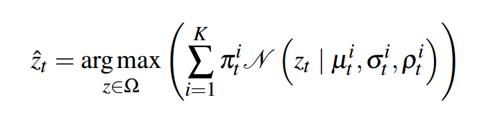

其中N为二元正态分布， 为预测的注视坐标

损失函数：该模型预测每个输入图像的注视序列长度为T。利用模型输出的K个高斯核参数构造每次注视的概率优先图。我们使用人类在相应时间步的实际注视位置进行监督学习，引导预测的概率优先图产生准确的注视。用于训练的损失函数是负对数似然函数，定义如下:

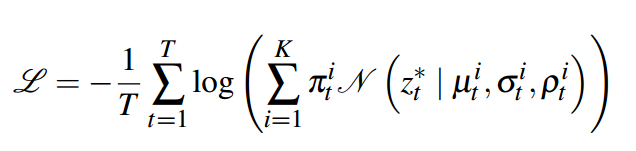

这里，T表示预测的注视序列的长度， 表示第T次实际的人类注视。

**实验：**

1.  定量比较

在自由观看模式下，我们将我们的模型与Itti等、SGC、wang等、SaltiNet、PathGAN、DeepGazeIII、IOR-ROI和VQA等8种基线扫视路径预测模型进行了比较。

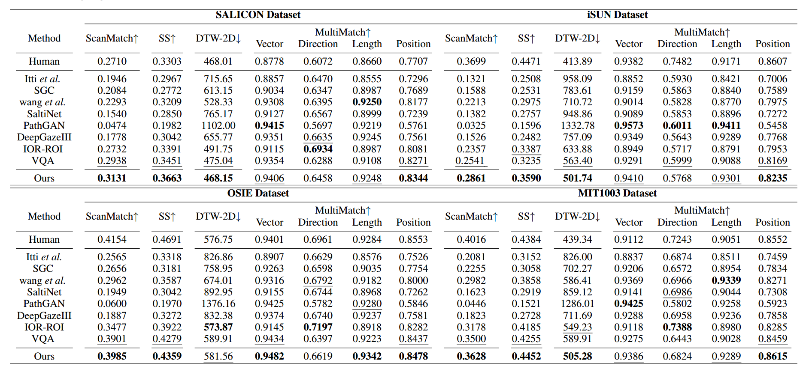

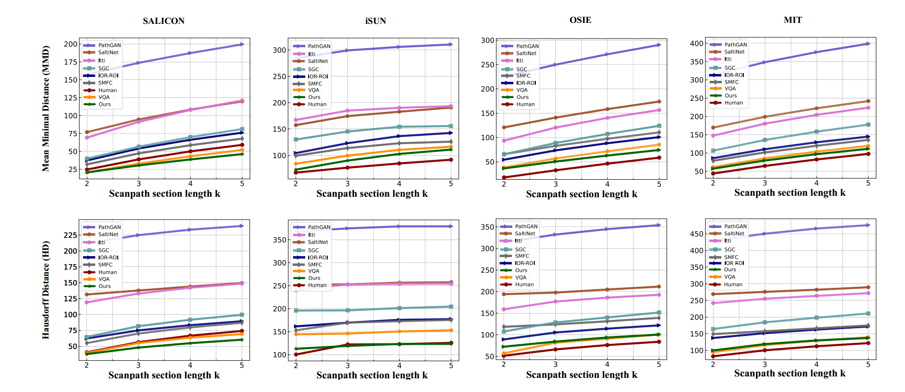

**定量评价：**表1为ScanMatch、SS、DTW、Multimatch的比较结果，图4为TDE的比较结果。可以看出，我们的方法在所有四个数据集上都比最先进的方法取得了更好的结果。使用ScanMatch和SS的评估指标，我们的模型在所有四个数据集上都优于其他模型。

它还在三个数据集上获得了最佳结果，在基于DTW度量的一个数据集上获得了第二好的结果。在TDE评价标准下，我们的模型在所有数据集上都显示出很大的优势。在许多研究中，Multimatch是常用来评估扫视路径模型性能的方法。然而，我们观察到基于向量、方向和长度的模型比较结果与其他评价标准不一致。在图4和表1中，尽管PathGAN 在 Multimatch的矢量、方向和长度得分很高，但在ScanMatch、SS、和TDE方面的性能明显低于其他模型。定性可视化还显示，PathGAN与实际的人类扫视路径表现出显著差异。尽管如此，我们的方法在大多数Multimatch指标上执行得非常好。

我们的方法可以很容易地扩展到任务导向的扫视路径预测任务。我们在AiR视觉问答数据集和COCOSearch18视觉搜索数据集上验证了我们的模型。与在自由观看场景中观察到的结果相似，我们的方法在视觉问答和视觉搜索任务中也表现出优异的性能。如表2、表3和图5所示，我们的方法在两个任务驱动的视觉扫视路径预测场景中优于最先进的方法，在ScanMatch、SS和TDE指标上取得了更好的结果。此外，我们的方法在Multimatch度量中实现了最一致的性能。

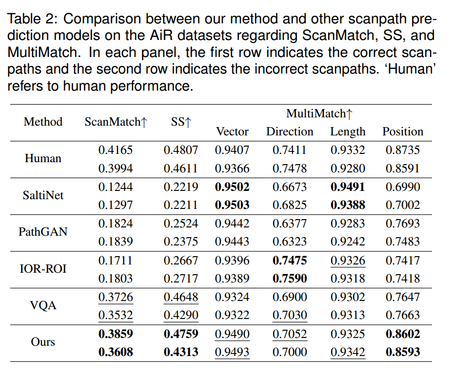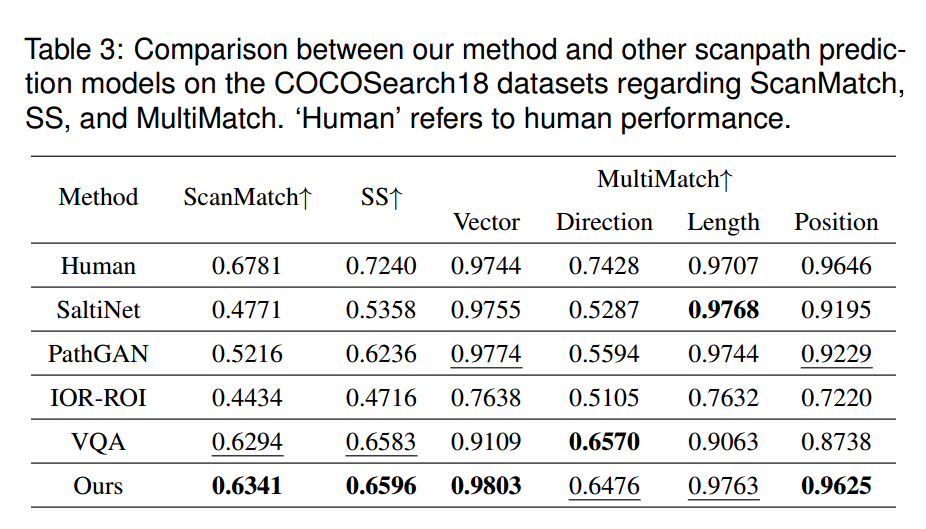

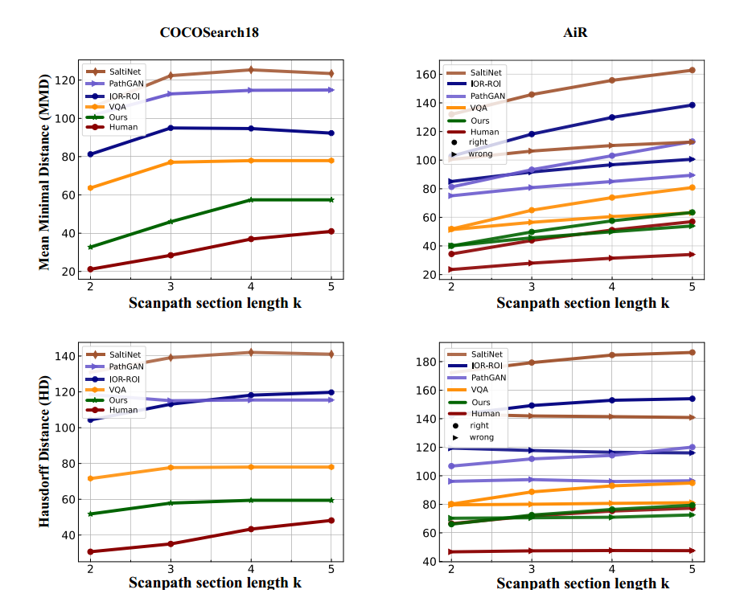

**定性评估**： 我们将扫视路径预测结果可视化，并将其与其他基线模型生成的扫视路径进行定性比较。对比结果如图6所示，每张图像右下角的数字代表对应扫视路径的ScanMatch值。如图6所示，我们的模型预测的扫视路径在不同的ScanMatch分数中具有更短且分布更均匀的扫视振幅，这与Le Meur等人从现有的真实人体扫视路径中总结的扫视振幅偏差一致。此外，虽然一些模型可以获得较高的ScanMatch分数，但其预测的扫视路径在可视化方面存在明显的局限性。例如Wang等预测的注视点往往集中在某一图像区域，这显然不是一个好的视觉探索路线。

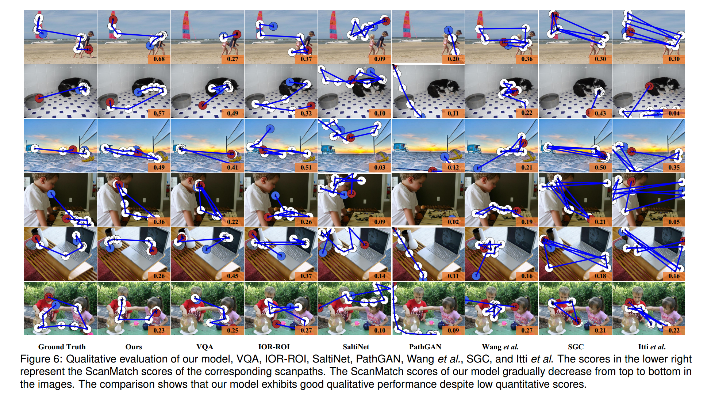

**未来和限制：**

在任务驱动的视觉探索场景中，我们以引导图的形式抽象了任务的影响，这可以进一步研究，以纳入来自不同任务模式的输入。我们提出了一种新的视觉扫视路径转换器来预测人们在自由观看和任务驱动场景下的视觉扫视路径。在预测扫视路径时，我们只关注注视的位置和顺序，而忽略了每次注视的持续时间。在未来，我们将预测每次注视的准确持续时间，并分析注视持续时间对整个注视序列的影响

**总结：**

我们提出了一种新的基于深度学习的视觉扫视路径预测模型VSPT，它既适用于自由观看，也适用于任务驱动的视觉探索。我们将低水平视觉刺激的显著性与上下文语义约束相结合，并通过建模注视之间的依赖关系来学习历史注视对扫视决策的影响，从而大大简化了扫视路径工作流和整体模型架构。实验表明，VSPT可以模拟人类探索视觉场景的决策过程，在自由观看和任务驱动(目标驱动和问题驱动)视觉场景中都优于目前的先进技术。视觉扫视路径预测性能的进步将有助于眼动追踪技术在虚拟现实/增强现实中的应用，提高人机交互(HCI)和渲染质量。
